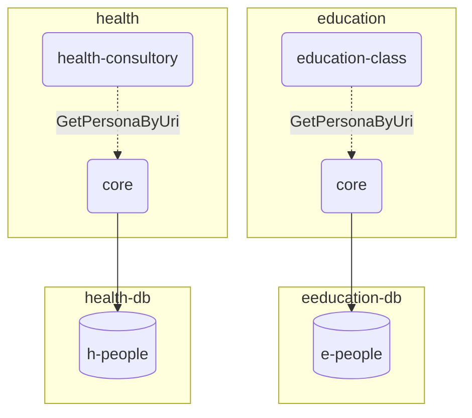
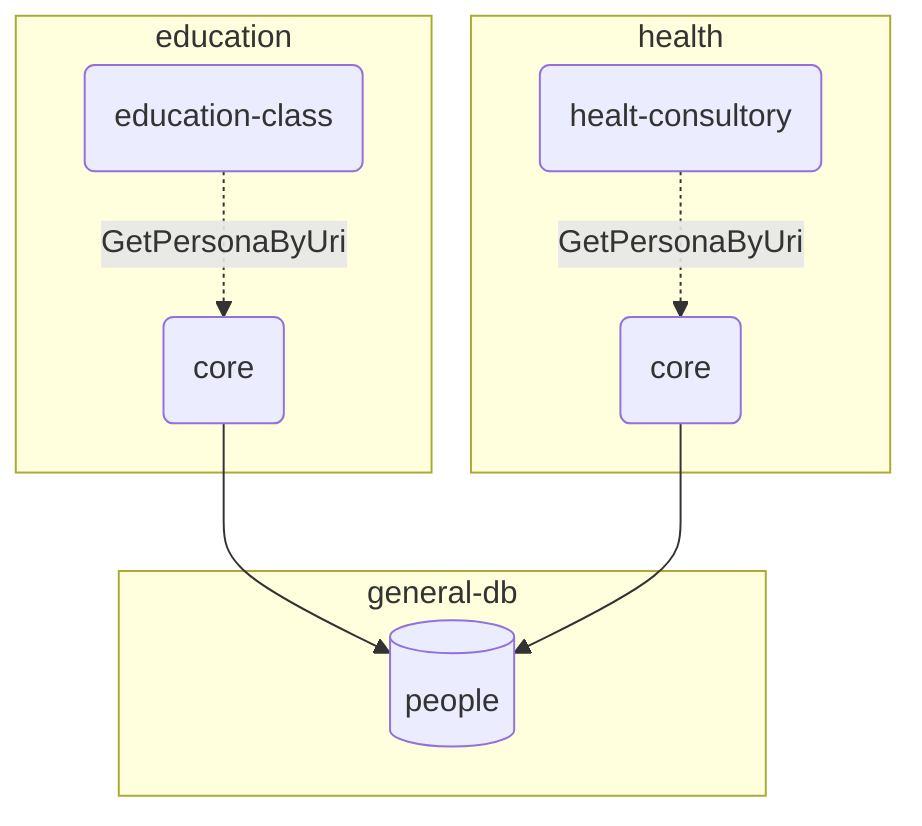
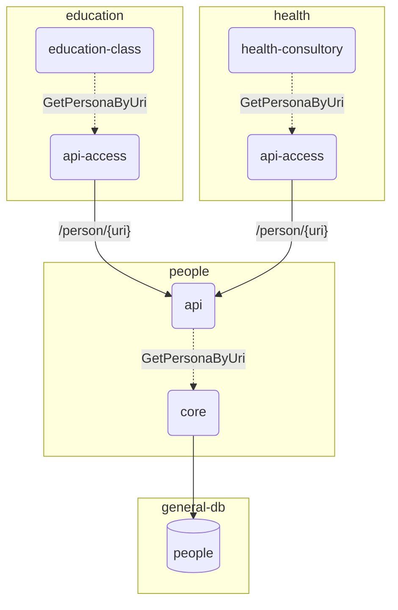
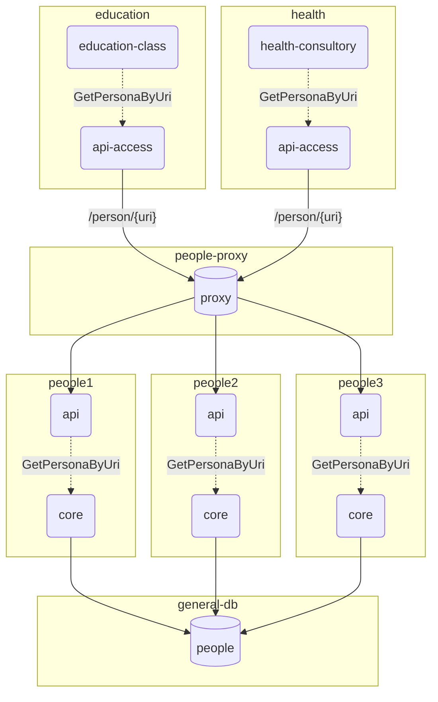

## Objetivo
El siguiente proyecto tiene como finalidad mostrar una opción a la implementación en capas que brinda la arquitectura hexagonal

Hay tres aplicaciones que se pueden levantar

- PeopleApiApp (dentro del proyecto people): Brinda un ejemplo de microservicio de busqueda de personas por uri.
- EduactionApp (dentro del proyecto education): Da un ejemplo de busqueda de estudiantes y docentes dado el nombre de un aula.
- HealthApp (dentro del proyecto health): Da un ejemplo de busqueda de pacientes y doctores dado el nombre de un consultorio.

Con el ejemplo brindado es posible levantar casos de uso compartidos por el proyecto people (En este caso solo un caso de uso GetPersonByUri) en los proyectos que lo requieren (educacion o health).

La ventaja es que se puede acceder a dos implementaciones de los casos de uso (en este caso solo GetPersonByUri) con solo modificar las propiedades:

- si requerimos que esta funcionalidad este de forma monolitica se deben levantar los casos de uso del paqueete core de people.

En el archiov properites setear:

```properties
people.service-impl=core
```


- si requerimos que esta funcionalidad este de forma distribuida en forma de microservicioes se deben levantar los casos de uso del paquete api-access de people.

```properties
people.service-impl=api-access
people.api.base-url=http://localhost:8080
```
## Ejemplos instanciados

### 1. Monolítico independiente

- Monolítico para `health` y `education`.
- Se accede a la implementación de `people` a través del módulo `people.core`.
- Cada instancia tiene su propia base de datos `people`.

```properties
people.service-impl=core
```


### 2. Monolítico con datos compartidos

- Monolítico para `health` y `education`.
- Se accede a la implementación de `people` a través del  `people.core`.
- Ambas instancias comparten la base de datos `people`.




### 3. Distribuido con acceso a única instancia de people

- Distribuido para `healt` y `education`.
- Se accede a la implementación de `people` a través del módulo `people.api-access` (una `api rest`).
- La instancia de `people` acceden a una base de datos única de `people`.

```properties
people.service-impl=api-access
```



### 4. Distribuido con acceso a multiples instancias de people

- Distribuido para `health` y `education`.
- Se accede a la implementación de `people` a través del modulo `people.api-access` (una `api rest`).
- se configura para que `api-access` se comunique con un proxy que deriva las peticiones a tres instancias de `people`.
- Las instancias de `people` acceden a una base de datos única de `people`.

```properties
people.service-impl=api-access
```



## Aclaraciones

- Los ejemplos responden ante cualquier valor dado de uri para simplificar la demostración.

- Ahora esta todo en el mismo proyecto git. Pero la idea es que haya tres proyectos diferentes people, education y health. Y que se vinculen con maven a traves de miltiproject (como se puede ver en este pom.xml principal) y con git submodule para tener todo en el mismo lugar.


